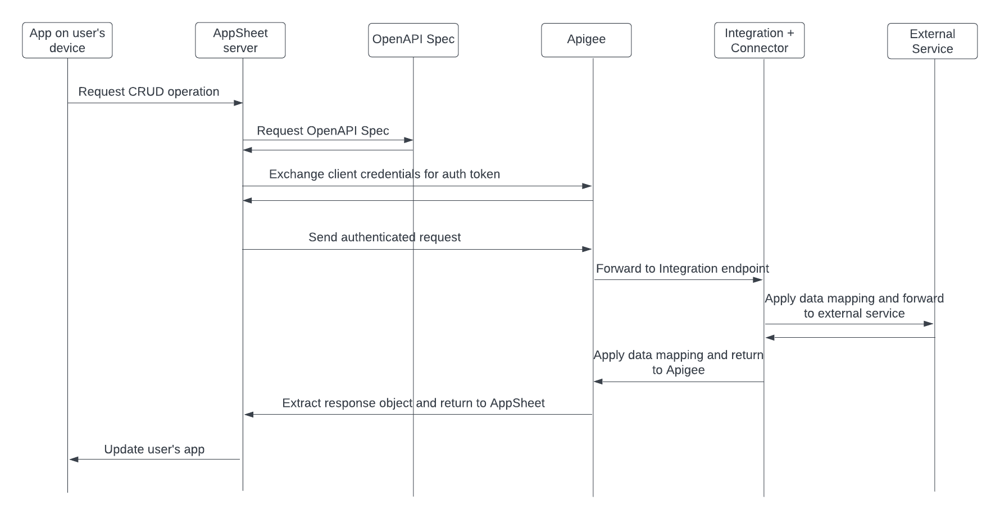

# Intro
This document describes how to use the Connectors platform as a data source in AppSheet. The following sequence diagram shows the whole process. The sections of this document describe each step. The recommended soundtrack for this solution is “[Ain’t No Mountain High Enough](https://youtu.be/-C_3eYj-pOM)”

# Integration Connectors platform overview
GCP Integration Connectors are a set of pre-built connectors designed to provide seamless integration between Google Cloud Platform (GCP) and various enterprise applications, such as SAP, Oracle, and ServiceNow. As an AppSheet data source, Connectors simplify the configuration of two-way communication between AppSheet apps and any supported external service. 

In the context of AppSheet, you can think of Connectors as a translator. Both AppSheet and the external service expect API communication in a specific format. Connectors standardize the request and response format between supported services. The app creator can then configure a single mapping with the Connectors platform and use it to integrate with any of the supported services.

See the [Integration Connectors reference](https://cloud.google.com/integration-connectors/docs/connector-reference-overview) for a list of supported service

# The Apigee data source for AppSheet
In this solution, Apigee is providing middleware to manage authentication and route requests to the correct integration endpoint. This documentation is based on features available in Apigee X. However, the overall solution could be adapted to work on Apigee Edge as well.

## Authentication between AppSheet and Apigee
AppSheet uses an OAuth client credentials grant type to authenticate with Apigee. In this process, Apigee serves as the identity provider (IdP). The process is described in the documentation page, [Implementing the client credentials grant type](https://cloud.google.com/apigee/docs/api-platform/security/oauth/oauth-20-client-credentials-grant-type). The high level steps are as follows:

1. Create an Apigee proxy to generate an OAuth token. Note the proxy endpoint. [Click here](Apigee/oauth.zip) for an example proxy that can be imported to Apigee.
