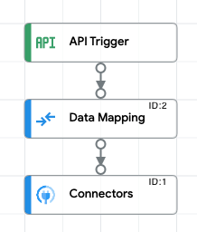

# Intro
This document describes how to use the Connectors platform as a data source in AppSheet. The following sequence diagram shows the whole process. The sections of this document describe each step. The recommended soundtrack for this solution is “[Ain’t No Mountain High Enough](https://youtu.be/-C_3eYj-pOM)”


# Integration Connectors platform overview
GCP Integration Connectors are a set of pre-built connectors designed to provide seamless integration between Google Cloud Platform (GCP) and various enterprise applications, such as SAP, Oracle, and ServiceNow. As an AppSheet data source, Connectors simplify the configuration of two-way communication between AppSheet apps and any supported external service. 

In the context of AppSheet, you can think of Connectors as a translator. Both AppSheet and the external service expect API communication in a specific format. Connectors standardize the request and response format between supported services. The app creator can then configure a single mapping with the Connectors platform and use it to integrate with any of the supported services.

See the [Integration Connectors reference](https://cloud.google.com/integration-connectors/docs/connector-reference-overview) for a list of supported service


# The Apigee data source for AppSheet
In this solution, Apigee is providing middleware to manage authentication and route requests to the correct integration endpoint. This documentation is based on features available in Apigee X. However, the overall solution could be adapted to work on Apigee Edge as well.

See the [product documenation](https://support.google.com/appsheet/answer/10106762?hl=en) for additional configuration details.

## Reverse proxy 
Apigee creates a reverse proxy, which just means Apigee is providing an API endpoint in front of your target endpoint. Kind of like a tinyurl in front of a long url. However, in the case of Apigee, additional policies are applied before the request is routed to the target endpoint. 

The overall purpose of Apigee is to
* Manage authentication with AppSheet via OAuth client credentials
* Separately manage authentication with Application Integration platform via attached service account
* Extract details from the request sent by AppSheet
* Use the exctracted details to transform the request into the format required by Application Integration

[Click here](Apigee/appsheet_api_integration_proxy.zip) for an example proxy that can be imported to Apigee

The policies that are applied depend on the type of request and are detailed in the following sections. 

### All requests
* Verify OAuth token
* Remove OAuth token from header
* Generate Google API auth token using attached service account
* Attach Google API auth token to header
* Reformat response before returning to AppSheet

### Fetch all records (GET)
* Add Integration trigger_id to payload

### Fetch specific record (GET)
* Extract record ID from path parameter
* Add Integration trigger_id and record ID to payload
### Create new record (POST)
* Add Integration trigger_id and record details to payload
### Update existing record (PUT)
* Extract record ID from path parameter
* Add Integration trigger_i, record ID, and records details to payload
### Delete existing record (DELETE)
* Extract record ID from path parameter
* Add Integration trigger_id and record ID to payload

## OpenAPI Spec
The OpenAPI spec defines the reverse proxy built in Apigee. It is also a required input when creating the API data source in AppSheet. The [OpenAPI specification (OAS)](https://swagger.io/specification/) defines a standard, language-agnostic interface to HTTP APIs.

The primary components of the spec are as follows
* Server url: the base path of the Apigee proxy
* Paths: the path suffixes that can be appended to the base path (e.g. /issues/{issue_id})
* Methods: supported HTTP methods (e.g. GET, POST, etc)
* Security: type (e.g. client credentials) and url to request token
* Parameters: format of the API response

The OpenAPI spec must be hosted such that AppSheet can send a request to the url and receive the spec in the response payload. You can use Apigee to host the spec by adding it to an AssignMessage policy.

**Example files**
* [API spec](Files/openapi_spec.txt) 
* [Proxy that can be imported to Apigee](Apigee/openapi_spec.zip)

## Authentication between AppSheet and Apigee
AppSheet uses the OAuth client credentials grant type to authenticate with Apigee. In this process, Apigee serves as the identity provider (IdP). The process is described in the documentation page, [Implementing the client credentials grant type](https://cloud.google.com/apigee/docs/api-platform/security/oauth/oauth-20-client-credentials-grant-type). The high level steps are as follows:

1. Create an Apigee proxy to generate an OAuth token. Note the proxy endpoint. [Click here](Apigee/oauth.zip) for an example proxy that can be imported to Apigee.
2. Specify the endpoint to request an OAuth token in the OpenAPI spec
3. In Apigee, create an [API product](https://cloud.google.com/apigee/docs/api-platform/publish/what-api-product) with access to the reverse proxy
4. In Apigee, create an [app](https://cloud.google.com/apigee/docs/api-platform/publish/creating-apps-surface-your-api) with access to the API product. The app generates a client ID and client secret that can be provided to AppSheet when adding the API data source.

## Authentication between Apigee and Application Integration Platform
The connection to the Application Integration platform requires a Google API authentication token. An auth token can be [generated for a service account](https://developers.google.com/identity/protocols/oauth2/service-account). AppSheet does not have a built-in method to generate an auth token based on a service account, but Apigee does.

The steps below describe how to create a service account with the correct permissions and attach it to an Apigee proxy.

 1. Create a service account in the same GCP project where the Apigee X runtime is depoloyed
 2. Add the service account from step 1 as a principal in the IAM setting for the GCP project where the Application Integration instance is configured. 
 3. Add the role 'Application Integration Invoker'
 4. When you deploy the [Apigee reverse proxy](#reverse-proxy), enter the service account address (e.g. my-sa@project_name.iam.gserviceaccount.com) in the Service Account box

 

# Application Integration Platform
The Application Integration platform connects Apigee to the target data source via an Integration Connector. 

See the [Integration Connectors reference](https://cloud.google.com/integration-connectors/docs/connector-reference-overview) for a list of supported services.

## Connector
The connector provides connectivity to a specific data source. The APIs for each data source have different requirements for the request and response format. The connectors provide a standardized interface by abstracting the unique requirements. This enables you to create an integration design pattern that can be reused with any of the supported Connectors. 

The following steps describe the process to create a connection

1. Follow the ['Create a connection'](https://cloud.google.com/integration-connectors/docs/manage-connections#create-a-connection) steps to get started.
2. [Select the target service](https://cloud.google.com/integration-connectors/docs/connector-reference-overview) for service-specific directions
3. Follow the steps for your specific service to create a connection

## Integration
The integration consists of three components:

1. API Trigger
2. Connector task
3. Data mapping

### API Trigger
The API Trigger provides a trigger ID so that the Integration can be executed by an API call. Each function should be organized into its own integration with its own API Trigger. To have full CRUD functionality, you need the following integrations

* Fetch all records
* Fetch specific record
* Create new record
* Update existing record
* Delete existing record

Use the [API documentation](https://cloud.google.com/application-integration/docs/reference/rest/v1/projects.locations.integrations/execute) to determine the format for the Integration API's url and request body. The [Integration Details](#integration-details) section has detailed examples.

The API documentation has a side bar that allows you to test your Integration as well. This is an easier and faster way to ensure everything is working before configuring Apigee. 

### Connector
The connector tasks performs the requested operation on the connected service. Commonly supported operations are: List, Get, Create, Delete, and Update.


### Data Mapping
The data mapping task is used at two points in the integration

1. Map the input variables received in the request payload to the input variables expected by the Connector.
2. Map the Connector response into the format expected by AppSheet


## Integration Details

This section provides screenshots for all the Integration components.

### Fetch all records
Screenshot of full integration


Screenshot of API trigger


Screenshot of Connector


Screenshot of Data Mapping


\<Set> block of AssignMessage policy in Apigee
```
  <Set>
    <Payload contentType="application/json">{"trigger_id":"api_trigger/get_jira_issues"}</Payload>
    <Verb>POST</Verb>
  </Set>
```

### Fetch specific record
Screenshot of full integration


Screenshot of API trigger


Screenshot of Data Mapping 1


Screenshot of Connector


Screenshot of Data Mapping 2


\<Set> block of AssignMessage policy in Apigee
```
  <Set>
    <Verb>POST</Verb>
    <Payload contentType="application/json">
            {
                "triggerId": "api_trigger/jira_issue",
                "inputParameters": {
                    "issueId": {"stringValue": "{path_params.issue_id}"}
                }
            }
        </Payload>
    <Verb>POST</Verb>
  </Set>
  ```

### Create new record
Screenshot of full integration


Screenshot of API trigger


Screenshot of Data Mapping


Screenshot of Connector


\<Set> block of AssignMessage policy in Apigee
```
  <Set>
    <Payload contentType="application/json">
            {
                "trigger_id":"api_trigger/create_jira_issue",
                "inputParameters": {
                    "issueObject": {"jsonValue": '{request.content}'}
                }
            }
        </Payload>
    <Verb>POST</Verb>
  </Set>
  ```

### Update existing record
Screenshot of full integration



Screenshot of API trigger


Screenshot of Data Mapping


Screenshot of Connector


\<Set> block of AssignMessage policy in Apigee
```
  <Set>
    <Verb>POST</Verb>
    <Payload contentType="application/json">
            {
                "triggerId": "api_trigger/update_jira_issue",
                "inputParameters": {
                    "issueId": {"stringValue": "{path_params.issue_id}"},
                    "issueObject": {"jsonValue": '{request.content}'}
                }
            }
        </Payload>
    <Verb>POST</Verb>
  </Set>
  ```

### Delete existing record
Screenshot of full integration


Screenshot of API trigger


Screenshot of Data Mapping


Screenshot of Connector


\<Set> block of AssignMessage policy in Apigee
```
  <Set>
    <Verb>POST</Verb>
    <Payload contentType="application/json">
            {
                "triggerId": "api_trigger/delete_jira_issue",
                "inputParameters": {
                    "issueId": {"stringValue": "{path_params.issue_id}"}
                }
            }
        </Payload>
    <Verb>POST</Verb>
  </Set>
```

# AppSheet
The previous sections describe how to create API proxy for the target API. The target API is the data source you want to connect to (e.g. SAP, Snowflake, Cloud SQL). The API proxy is middleware that translates between the required formats of AppSheet and the target.

With the middleware in place, the AppSheet app is quite simple. This section describes how to configure the data source and how to use the data source to build a useful app.

## Data source
The following steps describe how to connect AppSheet to your API proxy. See the [product documenation](https://support.google.com/appsheet/answer/10106762?hl=en) for full details.

1. Open Account settings > Sources 
2. Click '+ New Data Source'
3. Provide a name for the new data source and select 'Apigee'
4. Select OpenAPI Spec
5. Set 'Authorization Type' to 'OAuth'
6. Set 'Apigee Client Id' and 'Apigee Client Secret' to the values provided by Apigee when [creating the app](#authentication-between-appsheet-and-apigee).
7. Set 'OpenAPI Spec URL' to the address where your spec is hosted. You can test this by pasting it into a browser. The browser should display your spec as a page of text.
8. The example does not use any custom headers
9. Click 'Validate' then 'Authorize Access'

You can now use the data source in any of your AppSheet apps.


## Application
## Example Architecture
